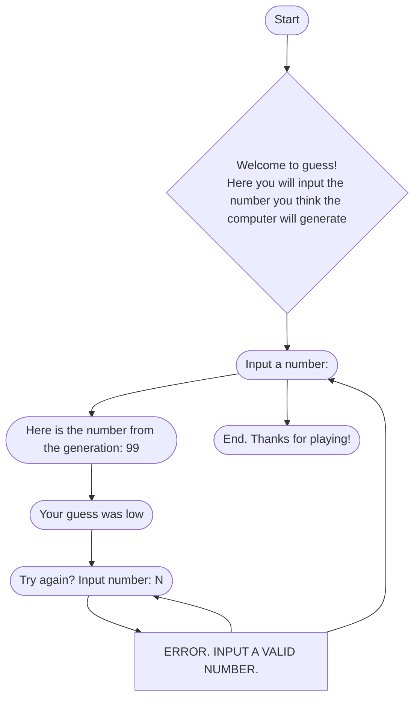

# Guessing

```mermaid
flowchart TD
Start([Start]) --> 
A{Welcome to guess!
Here you will input the number you think the computer will generate} --> B[ Input a number: 89];
B --> C([Here is the number from the generation: 99]);
C --> D([Your guess was low]);
D --> E([Try again? Input number: N])
E --> F[ERROR. INPUT A VALID NUMBER.];
F --> E;
F --> B([Input a number:])


--> End([End. Thanks for playing!])
```
